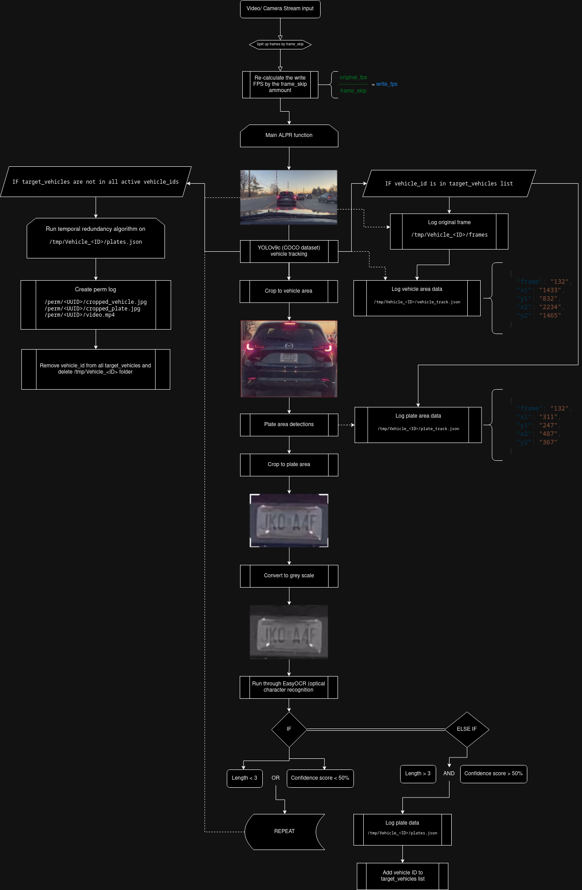

# Pursuit Alert
### Counter surveillance system that detects vehicles that may be following you using ALPR. Designed simply with open source projects.
<div align="center">

  
  
  

</div>

## Installation
Begin by cloning the repository to your local machine:
```bash
git clone https://github.com/chrismuntean/Pursuit-Alert.git
```

### Python virtual environment installation
```bash
chmod +x venv-run.sh
```
```bash
./venv-run.sh
```

**IMPORTANT**: Ensure that all requirements are fully installed before interrupting the installation process. If the installation does not complete successfully, you may need to remove the `pursuit-alert-venv` directory and execute `./venv-run.sh` again to reinstall the requirements.

### Docker installation


The Docker image is compatible with both amd64 and arm64 architectures, enabling deployment on standalone systems such as a Raspberry Pi or Jetson Nano.

For more details on the Docker image, visit the [Pursuit-Alert Docker Hub page](https://hub.docker.com/r/chrismuntean/pursuit-alert).

```bash
docker pull chrismuntean/pursuit-alert
```
```bash
docker compose up
```

## Features
### Current version: `v0.1.0-beta`

### Functionality Overview
- **Video Input Options**: Utilize a live USB camera feed or upload a pre-recorded video for analysis.
- **Frame Skipping**: Define frame skip settings to optimize processing.
- **Visual Feedback**: 
  - The status dropdown displays outputs from the computer vision models.
  - Resource usage is shown through bars located below the status dropdown.
- **Analysis Tools**:
  - Displays vehicle details such as plate number, sighting count, first and last sighting dates, and a calculated risk score.
  - Risk score calculation is based on the mean, median, and mode of total sightings across all observed plates.
  - Media logs for each vehicle can be accessed by selecting a plate on the Analysis page, featuring dropdowns for each sighting date and time, along with a cropped image of the vehicle and plate, and a video highlighting the vehicle in red labeled as "Target Vehicle".
- **Data Management**: Offers an option to clear all logs on the Analysis page for privacy and system performance.

### Technical Specifications
- **Vehicle Detection**: Utilizes [Ultralytics YOLOv9c](https://docs.ultralytics.com/models/yolov9/), a state-of-the-art model for accurate vehicle detection.
- **Plate Area Detection**: Employs the [License Plate Recognition LHQOW Dataset](https://universe.roboflow.com/objects-in-the-wild/license-plate-recognition-lhqow) to locate license plates within the video frames. Pretrained on YOLOv8n using Ultralytics. See model metrics [here](https://hub.ultralytics.com/models/ljPX6IZZrziN1kPva2Qn)
- **Plate Recognition**: Implements [EasyOCR english_g2](https://github.com/JaidedAI/EasyOCR) for extracting alphanumeric characters from license plates, enabling accurate plate string detection.

## Usage
This software is optimized for deployment on a standalone system within a vehicle. It functions independently without an internet connection to safeguard against data leaks and to ensure full data ownership.

The system is compatible with compact hardware setups such as a Raspberry Pi or an Nvidia Jetson Nano. It supports the addition of a small screen, enabling you to view real-time analysis of license plates detected on vehicles behind you.

## Demonstration
I'm slacking on these give me a bit

## How the ALPR works
This section presents a diagram that outlines the core functionalities of the automatic license plate recognition (ALPR) components within the system. It details the operational flow, configuration settings, tolerances, and logging procedures involved in the ALPR process.

The diagram below does not include aspects that are primarily aesthetic, such as the settings interface, CPU and RAM usage statistics, and the Analysis user interface, which are designed for user interaction and system monitoring rather than core functionality.



## Plans for further development
This application originated as my high school senior project. While the project served as a significant learning experience over the past year, I am currently uncertain about my ability to continue its development in the foreseeable future. However, I encourage anyone interested to build upon and expand this project. I am eager to see the innovative ways in which it can be enhanced and applied by others in the community!

## Development notebook
Throughout my high school senior project, I was required to maintain detailed daily logs that documented my learning and development progress. These logs include insights into my thought processes and the challenges I encountered while working on this project.

If you are interested in exploring these entries and witnessing the evolution of the project firsthand, you can access my Notion calendar containing all the notes. However, please be aware that this link may no longer be active at the time you try to access it. After my graduation, my high school will deactivate my school Google account, which could result in the deletion of these records.

Attempt to access development logs here: [Chris Muntean's dev logs](https://sparktechsolutions.notion.site/Muntean-Chris-40f87992478c47c99e366a3a97577a01) (*see September 2023 - April 2024*)

## Acknowledgments
This project was built using several open-source technologies and libraries. Special thanks to the teams behind each of these tools for making them available:
```
@article{wang2024yolov9,
  title={{YOLOv9}: Learning What You Want to Learn Using Programmable Gradient Information},
  author={Wang, Chien-Yao  and Liao, Hong-Yuan Mark},
  booktitle={arXiv preprint arXiv:2402.13616},
  year={2024}
}

@misc{
    license-plate-recognition-lhqow_dataset,
    title = { License Plate Recognition  Dataset },
    type = { Open Source Dataset },
    author = { Objects In The Wild },
    howpublished = { \url{ https://universe.roboflow.com/objects-in-the-wild/license-plate-recognition-lhqow } },
    url = { https://universe.roboflow.com/objects-in-the-wild/license-plate-recognition-lhqow },
    journal = { Roboflow Universe },
    publisher = { Roboflow },
    year = { 2022 },
    month = { jun },
    note = { visited on 2024-04-20 },
}

@misc{
    easyocr,
    title = { EasyOCR },
    type = { Open Source Software },
    author = { Jaided AI },
    howpublished = { \url{https://github.com/JaidedAI/EasyOCR} },
    url = { https://github.com/JaidedAI/EasyOCR },
    year = { 2020 },
    note = { visited on 2024-04-20 },
}
```
I am grateful to all the developers and contributors of these projects.

## License
Do whatever you want with my code. I don't care